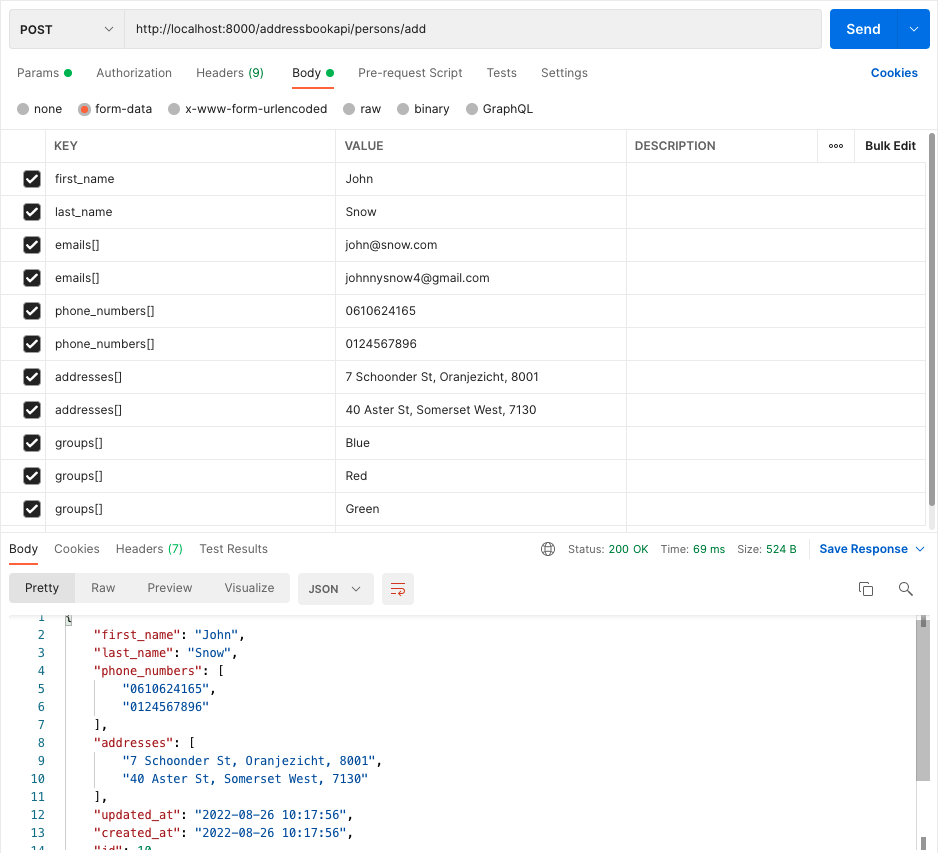

## Address Book API Demo Package

### Setup

#### Project

Create a project folder and CD to it. Do a git clone as follows:

> git clone git@github.com:gvanto/adress-book-api-demo.git .

Run `composer install` to install the vendor packages 
(includes the addressbookapi package which will be symlinked).

Copy .env.example to .env (for convenience it contains the correct MySQL login
connection details from below).

Run `php artisan serve` and visit http://localhost:8000/, you should see
a Laravel page.

#### MySQL Database

To quickly get the addressbookapi database up and running we can 
set it up using Docker:

Create the MySQL container:
> docker container run --name addressbookapi-mysql --publish 3306:3306 -e MYSQL_ROOT_PASSWORD=hello123 -d mysql:5.7

Create DB and user:

> mysql -h 127.0.0.1 -uroot -phello123
>
> create database addressbookapi;
>
> CREATE USER 'addressbookapi'@'%' IDENTIFIED BY 'hello123';
>
> GRANT ALL PRIVILEGES ON addressbookapi.* TO 'addressbookapi'@'%';
>
> FLUSH PRIVILEGES;

 

### Address Book API Endpoints

Endpoints base URI: http://localhost:8000/addressbookapi.

A tool such as PostMan can be be used to test the endpoints.

#### Add Person To Address Book
POST: {base_uri}/persons/add

**Inputs:**

*Please note: All inputs are required. Array-based input such as address, can
have multiple values ie. a person can have more than one of these.*

<ul>
<li><b>first_name</b>: First name, at least 2 characters</li>
<li><b>last_name</b>: Last name, at least 2 characters</li>
<li><b>emails[]</b>: Email(s), must be a valid email address and unique to this
 person. Multiple emails can be added by using subsequent 'emails[]' input values (see
example screenshot below).
</li>
<li><b>phone_numbers[]</b>: Phone number(s) (integers only for simplicity).
</li>
<li><b>addresses[]</b>: Address(es), as string. 
</li>
<li><b>groups[]</b>: Group, as string. The group(s) that the person should
be added to. If the group doesn't exist it will be created.
</li>
</ul>

**Response:**

On a successful request (Status 200), the created person's data is returned
in JSON format.

**PostMan request example:**

#### Add Group To Address Book
POST: {base_uri}/groups/add

**Inputs:**

*Please note: All inputs are required.*

<ul>
<li><b>name</b>: Group's name, at least 2 characters.</li>
</ul>

**Response:**

On a successful request (Status 200), the created Group's id is returned
in JSON format.

#### Get Group Members
GET: {base_uri}/groups/members?group={group}

**Inputs:**

*Please note: All inputs are required.*

<ul>
<li><b>group</b>: Group's name or id.</li>
</ul>

**Response:**

On a successful request (Status 200), the group's members (with result count)
will be returned in JSON format.
